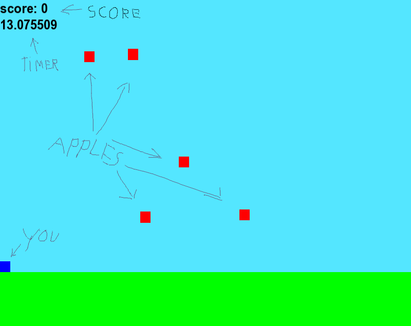

# Apple catch (REMASTERED)

## Opstraten
Op linux, voer **./apple_catch** uit om het spel te starten

## Compileren
Om zelf te compileren zijn de volgende benodigdheden vereist:

libsfml-dev

g++

voer **make all** uit in dezelfde folder als de Makefile om te compileren

## The making of
ik heb gekozen voor c++ als programmeer taal, omdat ik wou kijken hoe goed ik het onder de knie had. ik had eigelijk geen idee wat ik moest doen als onderwerp dus ik heb gewoon een oud spelletje van me gekopieerd. ik heb voor de game engine voor SFML gekozen omdat ik ergens had gelezen dat het makkelijk was om te leren. hieronder is een lijst van bronnen waar ik mijn informatie over SFML vandaan heb

https://www.sfml-dev.org/documentation/2.5.1/

https://riptutorial.com/sfml

## Het spel
het doel van het spel is om zo snel mogenlijk 20 appels uit de lucht te pakken.

